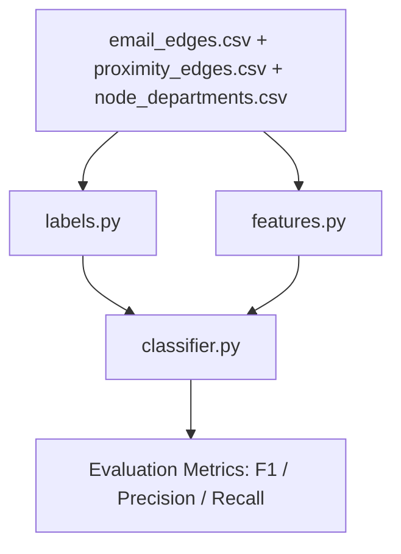

# Career Forecasting Module

Predicts career outcomes (**departed** / **promoted** / **stable**) for employees in a multi-layer network (Enron email + SocioPatterns proximity) using graph-based features and temporal betweenness.

---

## Workflow



### Step 1 — Build Labels (`labels.py`)

Reads the email edge list and produces per-`(node, month)` career labels:

| Label | Rule |
|-------|------|
| **departed** | Monthly email volume drops **>80%** vs 3-month rolling average |
| **promoted** | Department field changes between consecutive months |
| **stable** | Neither of the above |

**Entry point:** `build_career_labels(df_email, drop_threshold=0.80) → DataFrame[node, month, label]`

---

### Step 2 — Engineer Features (`features.py`)

Builds a feature matrix indexed by `(node, month)` with **9 predictors**:

| # | Feature | Type | Description |
|---|---------|------|-------------|
| 1 | `degree` | Static | Node degree in monthly email graph |
| 2 | `clustering` | Static | Local clustering coefficient |
| 3 | `burt_constraint` | Static | Burt's structural-hole constraint |
| 4 | `homophily_email` | Static | Fraction of email neighbours in same dept |
| 5 | `homophily_prox` | Static | Fraction of proximity neighbours in same dept |
| 6 | `cross_closure` | Static | Open triads in email closed in proximity layer |
| 7 | `tb_current` | Temporal | Temporal betweenness this month |
| 8 | `tb_3m_avg` | Temporal | Rolling 3-month average of TB |
| 9 | `tb_trend` | Temporal | Slope of TB over last 3 months |

**Entry point:** `engineer_features(df_email, df_proximity, df_departments, tb_series=None) → DataFrame`

---

### Step 3 — Train & Evaluate (`classifier.py`)

Uses **`TimeSeriesSplit(n_splits=5)`** to prevent future-data leakage.

| Function | Models | Purpose |
|----------|--------|---------|
| `train_and_evaluate()` | LogReg (static only) vs GBM (all features) | Primary evaluation + ablation |
| `retrain_improved()` | Tuned GBM (500 trees, depth=6) + Random Forest | Fallback if base scores are low |

Both functions return per-fold and aggregate **F1, Precision, Recall**.

---

## Quick Start

```python
import pandas as pd
from src.forecasting import build_career_labels, engineer_features, train_and_evaluate

# Load data
df_email = pd.read_csv("dataset/email_edges_sampled.csv")
df_prox  = pd.read_csv("dataset/proximity_edges.csv")
df_dept  = pd.read_csv("dataset/node_departments.csv")

# Pipeline
labels   = build_career_labels(df_email)
features = engineer_features(df_email, df_prox, df_dept)
results  = train_and_evaluate(features, labels, n_splits=5)
```

---

## File Structure

```
src/forecasting/
├── __init__.py      # Re-exports public API
├── labels.py        # Career label construction
├── features.py      # Static + temporal feature engineering
├── classifier.py    # GBM / LogReg / RF with time-series CV
└── README.md        # This file
```

## Dependencies

`networkx`, `scikit-learn`, `numpy`, `pandas` (see `requirements.txt`)
